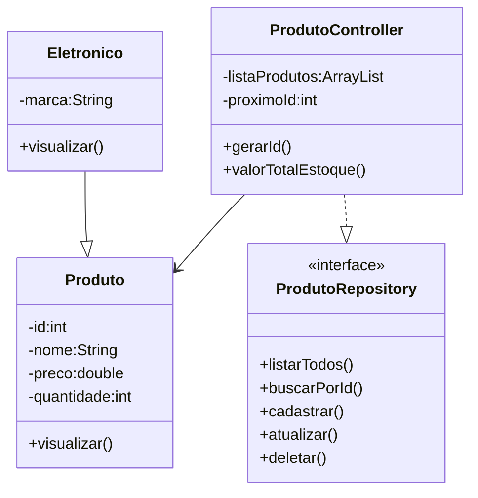

#  Projeto Sistema de Gerenciamento de Produtos - Java

<br>

<div align="center">


</div>

---

## 📖 1. Descrição

O **Sistema de Gerenciamento de Produtos** é uma aplicação desenvolvida em **Java** como projeto final do **Bloco 01**, permitindo o gerenciamento de produtos através de um menu interativo executado no terminal.

O sistema oferece funcionalidades para cadastro, consulta, atualização e exclusão de produtos, além da geração automática de ID e do cálculo do valor total do estoque.

Durante o desenvolvimento foram aplicados os principais conceitos da **Programação Orientada a Objetos (POO)**:

- Classes e Objetos
- Encapsulamento
- Herança
- Polimorfismo
- Classes Abstratas
- Interfaces
- Collections

---

## 🚀 2. Funcionalidades

- ✅ Cadastrar produtos
- ✅ Listar todos os produtos
- ✅ Buscar produto por ID
- ✅ Atualizar produtos
- ✅ Excluir produtos
- ✅ Calcular o valor total do estoque
- ✅ Geração automática de ID
- ✅ Interface colorida utilizando ANSI Colors

---

## 📊 3. Diagrama de Classes



---

## 💻 4. Tela Inicial

```text
=================================================

          SISTEMA DE PRODUTOS

=================================================

1 - Listar todos os Produtos
2 - Buscar Produto por ID
3 - Cadastrar Produto
4 - Atualizar Produto
5 - Deletar Produto
6 - Sobre
7 - Valor Total do Estoque
0 - Sair

=================================================
Escolha uma opção:
```

O menu permite acessar todas as funcionalidades do sistema de forma simples e organizada.

---

## 🛠️ 5. Tecnologias Utilizadas

- Java 17
- Eclipse IDE
- Git
- GitHub

---

## ▶️ 6. Como Executar

### Clone o repositório

```bash
git clone https://github.com/phcarneiro9/projeto_final_bloco_01.git
```

### Execute o projeto

1. Importe o projeto no Eclipse.
2. Abra a classe `Menu.java`.
3. Execute como **Java Application**.
4. Utilize o menu no terminal.

---

## 📁 Estrutura do Projeto

```text
src/
└── projeto_final_bloco_01
    ├── controller
    ├── model
    ├── repository
    ├── util
    └── Menu.java
```

---

## 👨‍💻 Autor

**Patrick Carneiro**

GitHub: https://github.com/phcarneiro9

---
