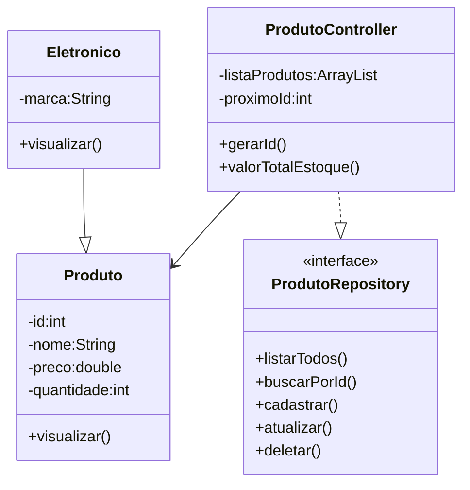

# Projeto Sistema de Gerenciamento de Produtos - Java

<br />

<div align="center">


</div>

---

<br />

## 1. Descrição

<br />

O **Sistema de Gerenciamento de Produtos** é uma aplicação desenvolvida em **Java** para o **Projeto Final do Bloco 01**, permitindo realizar o gerenciamento de produtos através de um menu interativo no terminal.

O sistema oferece operações de **cadastro**, **consulta**, **atualização** e **remoção** de produtos, além da geração automática de ID e do cálculo do valor total do estoque.

O projeto foi desenvolvido com foco na aplicação dos principais conceitos da **Programação Orientada a Objetos (POO)**, como:

- Classes e Objetos;
- Encapsulamento;
- Herança;
- Polimorfismo;
- Classes Abstratas;
- Interfaces;
- Collections.

<br />

## 2. Funcionalidades do Projeto

<br />

1. **Cadastrar Produto:** Cadastro com geração automática de ID.
2. **Listar Produtos:** Exibe todos os produtos cadastrados.
3. **Buscar Produto por ID:** Consulta um produto pelo identificador.
4. **Atualizar Produto:** Atualiza as informações de um produto.
5. **Excluir Produto:** Remove um produto do sistema.
6. **Valor Total do Estoque:** Calcula automaticamente o valor total do estoque.
7. **Interface Colorida:** Mensagens de sucesso, erro e informações utilizando ANSI Colors.

<br />

## 3. Diagrama de Classes

<br />



<br />

## 4. Tela Inicial do Sistema

\```text
=================================================

              SISTEMA DE PRODUTOS

=================================================

1 - Listar todos os Produtos
2 - Buscar Produto por ID
3 - Cadastrar Produto
4 - Atualizar Produto
5 - Deletar Produto
6 - Sobre
7 - Valor total do estoque
0 - Sair

=================================================
Escolha uma opção:
\```

Através desse menu é possível acessar todas as operações do sistema de forma simples e intuitiva, permitindo o gerenciamento completo dos produtos cadastrados.

## 5. Requisitos

<br />

- Java JDK 17+
- Eclipse IDE ou Spring Tool Suite (STS)
- Git

<br />

## 6. Como Executar o Projeto

<br />

### Clonando o repositório

```bash
git clone https://github.com/phcarneiro9/projeto_final_bloco_01.git
```

### Executando

1. Importe o projeto no Eclipse.
2. Abra a classe **Menu.java**.
3. Execute como **Java Application**.
4. O menu será exibido no console.

<br />

## 7. Autor

<br />

Desenvolvido por **Patrick Carneiro**

GitHub: **https://github.com/phcarneiro9**
